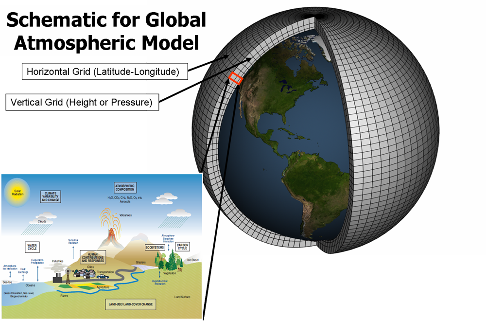

Climate Context
======================

.. _climatemodels:

What are climate models?
------------------------

A climate model is a complex computational representation of the Earth's climate system. These models simulate the interactions between various components of the Earth, including the atmosphere, oceans, land surface, ice, and other factors, to predict and understand climate patterns and changes over time. Climate models are important tools for studying the Earth's climate, making predictions about future climate conditions, and assessing the potential impacts of various factors such as greenhouse gas emissions, land use changes, and atmospheric composition.

What do they include?

- Atmospheric Model: Simulates the behaviour of the Earth's atmosphere, including temperature, pressure, humidity, and wind patterns.

- Ocean Model: Represents the behaviour of the world's oceans, including ocean currents, temperatures, and sea ice.

- Land Surface Model: Simulates processes on land, such as vegetation dynamics, soil moisture, and land-atmosphere interactions.

- Sea Ice Model: Represents the formation, melting, and movement of sea ice in polar regions.

- Biogeochemical Model: Incorporates biological and chemical processes, including the carbon cycle, to simulate interactions between the atmosphere, oceans, and land.
 
These models use mathematical equations to describe the physical, chemical, and biological processes that occur in each component of the Earth system. They are run on powerful supercomputers, which still take a long time, sometimes even several months to simulate climate conditions over time spans ranging from years to centuries and are validated against historical climate data to ensure their accuracy and reliability.

What is their purpose?

- Understanding Climate Processes: Models help scientists understand the fundamental processes driving climate variability and change.

- Predicting Future Climate: By inputting different scenarios of human activities and natural processes, models can project future climate conditions under different circumstances.

- Assessing Climate Impact: Models are used to assess the potential impacts of climate change on ecosystems, agriculture, water resources, and human societies.

- Policy Decision Support: Climate models provide information to policymakers to make informed decisions about climate mitigation and adaptation strategies.

Types

ESMs and GCMs

GCMs and ESMs are both types of climate models used in climate research. They stand for General Circulation Models (GCMs) and Earth System Models (ESMs).
 
GCMs, or Global Climate Models, are complex computer simulations that represent Earth's climate system. These models integrate physical, chemical, and biological processes to simulate climate patterns, allowing scientists to study and make predictions about future climate conditions.
 
ESMs typically refer to Earth System Models, which are an advanced form of climate models that incorporate not only the atmosphere but also interactions with oceans, land, ice, and other components of the Earth system. They aim to simulate a more comprehensive representation of the Earth's climate.
The main difference between GCMs (Global Climate Models) and ESMs (Earth System Models) lies in their scope. GCMs primarily focus on the atmosphere, whereas ESMs consider a broader range of components, providing a more holistic understanding of the Earth's climate by incorporating interactions between the atmosphere, oceans, land, and other elements. In essence, ESMs build upon GCMs by including a more integrated representation of the Earth system, which is why we exclusively use ESMs in ClimateSet.
 
It's important to note that while climate models are powerful tools, they have limitations and uncertainties. Improving the accuracy of models requires ongoing research, refinement, and validation against observed climate data. One of the recent improvements, and the one we focus on in ClimateSet, is using ML algorithms (ClimaX, U-Net, ConvLSTM, etc.) to emulate these models using much less computing power and hopefully achieving better accuracy.

.. _forcings:

What are Forcings?
------------------

In climate models, "forcing" refers to external factors that influence the Earth's energy balance. This includes natural and human-induced changes such as variations in solar radiation, greenhouse gas emissions, aerosols, and land use. Forcings can lead to warming (positive radiative forcing) or cooling (negative radiative forcing) effects on the climate. Understanding and simulating these forcings help scientists study past climate changes and project future climate scenarios.

SSP Scenarios

SSP stands for Shared Socioeconomic Pathway, which is a set of scenarios that describe alternative future pathways of global development, particularly focusing on how socioeconomic factors may influence greenhouse gas emissions and other drivers of climate change.
 
The SSPs are used in conjunction with Representative Concentration Pathways (RCPs) to explore different potential futures for climate research. While RCPs specify the concentrations of greenhouse gases in the atmosphere, SSPs provide a narrative and quantitative description of future societal developments, including demographics, economic structures, energy use, land use, and technological advancements.

The numbers following SSP (e.g., SSP1-1.9, SSP1-2.6) represent the radiative forcing level in watts per square metre (W/m²) by the end of the 21st century for the respective scenario. Lower numbers indicate lower radiative forcing, implying more stringent climate mitigation measures, while higher numbers suggest higher emissions and less stringent mitigation. For example, SSP1-1.9 corresponds to a scenario aiming to limit global warming to 1.9°C, while SSP1-2.6 targets a 2.6°C limit. These values help quantify the extent of climate change mitigation in each scenario, providing a basis for understanding potential future climate conditions.

.. image:: Atmospheric_CO₂_concentrations_by_SSP_across_the_21st_century.png
   :alt: Different SSP Scenarios Source: Sfdiversity, CC BY-SA 4.0 <https://creativecommons.org/licenses/by-sa/4.0>, via Wikimedia Commons
   
IPCC Assessment Reports

The IPCC Assessment Reports are comprehensive scientific evaluations of climate change, produced by thousands of experts. They cover the physical science basis, impacts on ecosystems and societies, and options for mitigation. The reports provide policymakers with crucial information for international climate negotiations and decisions. The assessment process includes consensus-building and is regularly updated to reflect the latest scientific knowledge, the most recent one being IPCC AR 6 from July 2023.

.. _inputs_outputs:

Inputs and Outputs of a Climate Model
-------------------------------------

Climate models take a range of inputs and produce various outputs to simulate and predict the behaviour of the Earth's climate system.

Inputs

The inputs of a climate model comprise crucial elements defining the Earth's climate system's initial state and external influences. Key components in ClimateSet's context include:

- Initial Conditions: The starting state of the atmosphere, oceans, land, and ice components.
- Emission Scenarios: Future projections of greenhouse gas emissions, land use changes, and human activities.
- Observational Data: Real-world observations assimilated to refine model simulations.
- Forcing Data: External data influencing the model, e.g., observational datasets.
- Computational Grid: Spatial and temporal resolution, determining simulation detail.
- Model Parameters: Values defining model components like cloud physics, ocean circulation, and vegetation properties.

Outputs

The output of a climate model comprises a diverse set of information representing the simulated behaviour of the Earth's climate system. Key components of climate model outputs include:
 
- Climate Variables:
   - Temperature, precipitation, humidity, wind speed, and other atmospheric variables.
   - Oceanic variables, including sea surface temperature, ocean currents, and salinity.
   - Land surface variables, such as soil moisture, snow cover, and vegetation.
- Uncertainty Estimates: Models often provide uncertainty ranges for various variables to account for the inherent uncertainties in climate predictions.
 
Model outputs are often used in conjunction with observational data to validate and improve the models, ensuring they provide reliable and actionable information.

Dimensionalities

In the context of climate modelling, "dimensionalities" refer to the diverse aspects and variables considered in model simulations. This encompasses factors like spatial and temporal resolutions, climate variables, radiative forcing, sea level change, extreme events, carbon cycle dynamics, feedback mechanisms, uncertainty estimates, and more. Managing these dimensionalities is crucial for comprehensive climate modelling, ensuring simulations capture the complexities of Earth's climate system. It involves representing various dimensions of information to provide accurate and meaningful outputs for understanding climate processes and predicting future conditions.

Types of experiments on climate models

Scientists run various types of experiments on climate models to study different aspects of the Earth's climate system and assess the potential impacts of various factors. Some common types of experiments include:
 
- Historical Simulations: Models are run using observed historical data for atmospheric composition, solar radiation, and other relevant variables to simulate past climate conditions. 

- Future Projections:  Models simulate future climate conditions under different scenarios of greenhouse gas emissions, land use changes, and other human activities. 

- Sensitivity Experiments: Scientists systematically vary specific model parameters or initial conditions to assess the sensitivity of the climate system to changes in those factors.
 
- Emission Scenarios: Models are used to project future climate conditions based on different scenarios of future greenhouse gas emissions. 

- Impact Assessments:  Models are employed to assess the potential impacts of climate change on ecosystems, agriculture, water resources, and human societies.

- Paleoclimate Simulations:  Models are run to simulate past climates, including periods with different concentrations of greenhouse gases, ice ages, and warm intervals. 

.. _datasources:

Data Sources
------------

CMIP6

CMIP6 (Coupled Model Intercomparison Project Phase 6) is a collaborative effort for climate modelling. ClimateSet utilises CMIP6, presenting a dataset with outputs from 36 climate models. It addresses the need for large, consistent datasets in machine learning (ML) for climate-related tasks. CMIP6 models inform the IPCC reports, and ClimateSet's modular pipeline fetches and preprocesses CMIP6 data for ML applications. The dataset's value lies in its ability to train ML models at scale, enabling the community to contribute to climate tasks.

Input4Mips

Input4MIPs refers to Input Datasets for Model Intercomparison Projects. It collects future emission trajectories of climate-forcing agents used as input for climate models. Endorsed by CMIP6, it aligns with ClimateSet's CMIP6 data, providing essential climate model input. Input4MIPs encompass different climate-forcing trajectories based on SSP scenarios, crucial for understanding future climate changes. ClimateSet specifically selects four main SSP scenarios and four climate forcers from Input4MIPs, emphasising the importance of these trajectories in training machine learning models for climate emulation tasks.

ESGF (Earth System Grid Federation)

The Earth System Grid Federation (ESGF) is an organisation that serves as the primary source for climate model data retrieval in ClimateSet. It enables the download of diverse climate datasets from various sources, including the above-mentioned Input4Mips and CMIP6 datasets, which facilitates the creation of a consistent and large-scale dataset for machine learning applications in climate science.

Different Tasks with Climate Models

Climate projection

Climate projection involves forecasting future climate conditions based on various scenarios. It employs climate models to simulate the Earth's response to different greenhouse gas emissions, aerosols, and other influencing factors. These models project changes in temperature, precipitation, wind patterns, and more, providing insights into potential future climatic conditions. Climate projections are vital for policymakers, allowing them to anticipate and plan for potential impacts on ecosystems, societies, and economies. In ClimateSet, the core dataset utilises climate models to capture projection uncertainties, which is essential for training machine learning models and informing climate-related decision-making.

Downscaling

Downscaling in climate science refers to the process of refining climate model outputs to a finer spatial resolution. Global Climate Models (GCMs) often have coarse resolutions, making them less suitable for regional-scale analyses. Downscaling involves using statistical or dynamical techniques to generate higher-resolution climate projections. ClimateSet may implement downscaling methods to enhance the spatial precision of its dataset, providing more detailed information about local climate impacts. Downscaled data allows researchers to better understand regional variations in climate patterns, essential for addressing localised impacts of climate change and supporting more accurate decision-making in areas such as agriculture, water resources, and infrastructure planning.

In general, increasing the spatial resolution of a model by a factor of two will require around 10 times the computing power to run in the same amount of time. (Source: https://scied.ucar.edu/longcontent/climate-modeling)

Climate Model Emulation
-----------------------

Climate emulation involves the development of machine learning models to simulate climate model outputs. The goal is to create emulators that can predict climate variables with greater efficiency than traditional climate models during inference. In this context, emulators receive input data such as greenhouse gas emission trajectories and generate climate projections. ClimateSet serves as a valuable resource for large-scale climate emulation tasks by providing a comprehensive dataset derived from 36 climate models.

Emulation is crucial for handling the computational intensity of climate modelling, enabling faster simulations while maintaining accuracy. Two types of emulators are available in ClimateSet: Single Emulators, trained on individual climate models, and Super Emulators, capable of projecting responses from multiple models. Climate emulation plays a pivotal role in advancing climate research, facilitating tasks like predicting temperature and precipitation patterns. It is important to evaluate emulators across diverse climate models to ensure robust performance and generalisation.

Metrics

Climate model emulation metrics are quantitative measures used to assess the accuracy and performance of machine learning models in simulating climate variables. In ClimateSet, the latitude-longitude weighted root mean squared error (RMSE) is a primary evaluation metric for assessing the performance of emulators. This metric quantifies the difference between predicted and observed values, providing insights into the model's ability to replicate climate model outputs. Robust evaluation metrics are crucial for determining the reliability and generalisation capabilities of emulators across diverse climate models.

Additional
----------

Accuracy of climate model projections of temperature

Climate models provide accurate projections of the overall trend and patterns of global temperature changes over the long term. They capture the fundamental warming trend associated with increased greenhouse gas concentrations. However, uncertainties exist in predicting specific regional variations, short-term fluctuations, and the exact magnitude of temperature changes. Ongoing advancements in model development and increased understanding of key processes aim to reduce uncertainties and enhance the accuracy of temperature projections. Evaluation against observed data and continuous model refinement contribute to improving the reliability of climate model temperature predictions.

Main limitations in climate modelling

Current limitations in climate modelling include finite spatial resolution, challenges in accurately representing cloud processes, uncertainties in feedback, incomplete understanding of biogeochemical processes, difficulties in simulating past climates and ice sheet dynamics, and challenges in predicting extreme events. Ocean circulation complexities, uncertainty quantification, and the need for substantial computational resources also pose challenges. Ongoing research aims to address these limitations and improve the accuracy of climate models for more reliable future projections and impact assessments.

Sources
-------

Watson-Parris, D. (2021). Machine learning for weather and climate are worlds apart. Philosophical Transactions of the Royal Society A, 379(2194), 20200098. https://doi.org/10.1098/rsta.2020.0098

McSweeney, Robert. “Q&A: How Do Climate Models Work?” Carbon Brief, July 20, 2022. https://www.carbonbrief.org/qa-how-do-climate-models-work/.

IPCC, 2018: Annex I: Glossary [Matthews, J.B.R. (ed.)]. In: Global Warming of 1.5°C. An IPCC Special Report on the impacts of global warming of 1.5°C above pre-industrial levels and related global greenhouse gas emission pathways, in the context of strengthening the global response to the threat of climate change, sustainable development, and efforts to eradicate poverty [Masson-Delmotte, V., P. Zhai, H.-O. Pörtner, D. Roberts, J. Skea, P.R. Shukla, A. Pirani, W. Moufouma-Okia, C. Péan, R. Pidcock, S. Connors, J.B.R. Matthews, Y. Chen, X. Zhou, M.I. Gomis, E. Lonnoy, T. Maycock, M. Tignor, and T. Waterfield (eds.)]. Cambridge University Press, Cambridge, UK and New York, NY, USA, pp. 541-562, doi:10.1017/9781009157940.008.